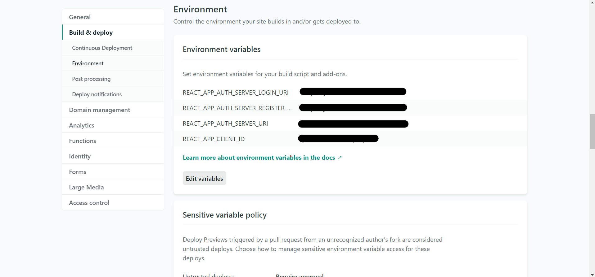

# Installation

## Prerequisites

The single-page application requires that two other services are up running:

* An instance of the Journal de bord RESTful API: this web service is used by the SPA to handle the users journal de bord resources. You can find its code in this [repository](https://github.com/Lofaloa/journal-de-bord-rest-api).
* An authorization server: this is the authority that secures the users resources. In my case, I have developed the project using an [instance of Keycloak embedded in a Spring Boot application](https://github.com/Lofaloa/journal-de-bord-authorization-server).

In the next section, you can find the required information that you need to provide to the SPA to make it work.


Currently, the application is still in development and it is not integrated with the REST API.


## Configuration

The application relies on multiple environment variables. They are described in the following subsection.

### Environment Variables

You need need to specify a value for each of the following variables in the `.env` file \(this file lives at the root of the project\).

* `REACT_APP_AUTH_SERVER_URI`: is the root URI of the authorization server.
* `REACT_APP_CLIENT_ID`: is the identifier of this web client registered in your authorization server.
* `REACT_APP_AUTH_SERVER_TOKEN_URI`: is the authorization server endpoint that provide this client with an access token.
* `REACT_APP_AUTH_SERVER_LOGIN_URI`: is the authorization server endpoint that provide this client with a login page.
* `REACT_APP_AUTH_SERVER_REGISTER_URI` : is the authorization server endpoint that provide this client with a register page.


 The custom environment variables are set following the [React documentation](https://create-react-app.dev/docs/adding-custom-environment-variables/).


### How to configure

```text
# Clone or download the project
git clone https://github.com/Lofaloa/journal-de-bord-spa.git

# Be sure to set your working directory to the project root
cd journal-de-bord-spa

# .env.example is an existing template for the .env file. The variables are
# required for the project to run
cp .env.example .env

# Edit the .env file and set the variables values
vi .env
```

### Sample `.env` file

In the root of the project you can find the `.env.example`. The file is the one referred to in the previous subsection. Here is its content.

```bash
REACT_APP_AUTH_SERVER_URI=authServerUri
REACT_APP_RESOURCE_SERVER_URI=resourceServerUri
REACT_APP_CLIENT_ID=clientId
REACT_APP_AUTH_SERVER_LOGIN_URI=authServerLoginUri
REACT_APP_AUTH_SERVER_REGISTER_URI=authServerRegisterUri
```

## Deployment

This web client is published on Netlify. This section focuses on this platform. The configuration is easy. Netlify documentation explains how it is done right [here](https://docs.netlify.com/configure-builds/environment-variables/#declare-variables).

### Configuration

Netlify explains how to publish on this [tutorial](https://www.netlify.com/blog/2016/09/29/a-step-by-step-guide-deploying-on-netlify/). Currently, the project is automatically deployed on Netlify when a branch is merged to the master. I still need to configure the environment variables manually.

To set the variables \(as described in the previous section\), go to:

1. Go to [app.netlify.com](https://app.netlify.com/)
2. Open the site to set the variables for
3. Go to Site _Settings_
4. Go to the _Build & Deploy_ section
5. Go to _Environment_

You should find this following screen. There you go 😁! Go ahead and set the required environment variables.



